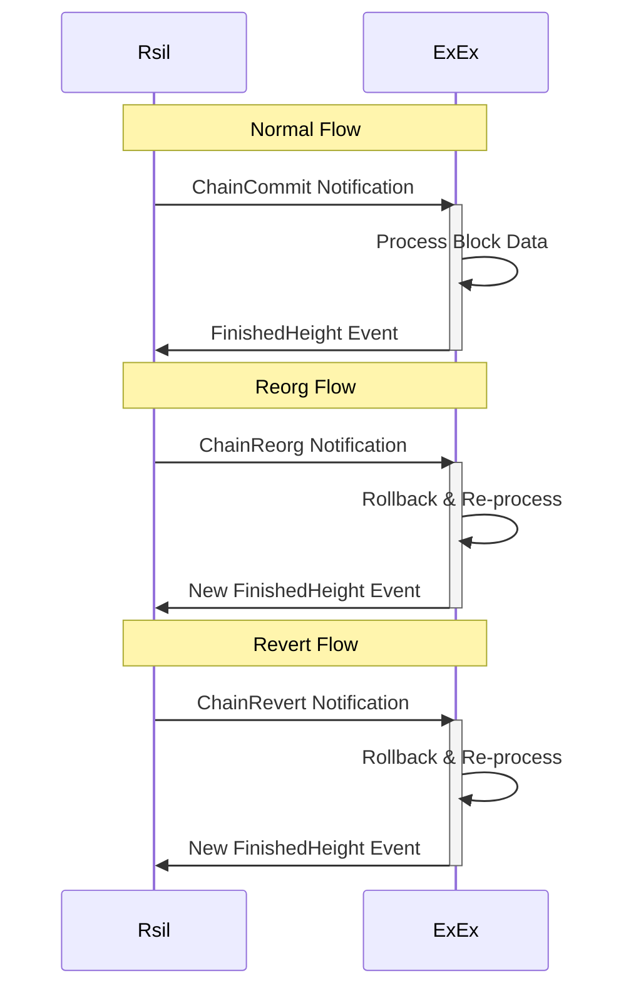

# How do ExExes work?

## Architecture

ExExes are just [Futures](https://doc.rust-lang.org/std/future/trait.Future.html) that run indefinitely alongside Rsil
– as simple as that.

An ExEx is usually driven by and acts on new notifications about chain commits, reverts, and reorgs, but it can span beyond that.

They are installed into the node by using the [node builder](https://rsil.rs/docs/rsil/builder/struct.NodeBuilder.html).
Rsil manages the lifecycle of all ExExes, including:

-   Polling ExEx futures
-   Sending [notifications](https://rsil.rs/docs/rsil_exex/enum.ExExNotification.html) about new chain, reverts,
    and reorgs from historical and live sync
-   Processing [events](https://rsil.rs/docs/rsil_exex/enum.ExExEvent.html) emitted by ExExes
-   Pruning (in case of a full or pruned node) only the data that has been processed by all ExExes
-   Shutting ExExes down when the node is shut down

## Pruning

Pruning deserves a special mention here.

ExExes **SHOULD** emit an [`ExExEvent::FinishedHeight`](https://rsil.rs/docs/rsil_exex/enum.ExExEvent.html#variant.FinishedHeight)
event to signify what blocks have been processed. This event is used by Rsil to determine what state can be pruned.

An ExEx will only receive notifications for block numbers greater than the block in the most recently emitted `FinishedHeight` event.

To clarify: if an ExEx emits `ExExEvent::FinishedHeight` for `block #0` it will receive notifications for any `block_number > 0`.
