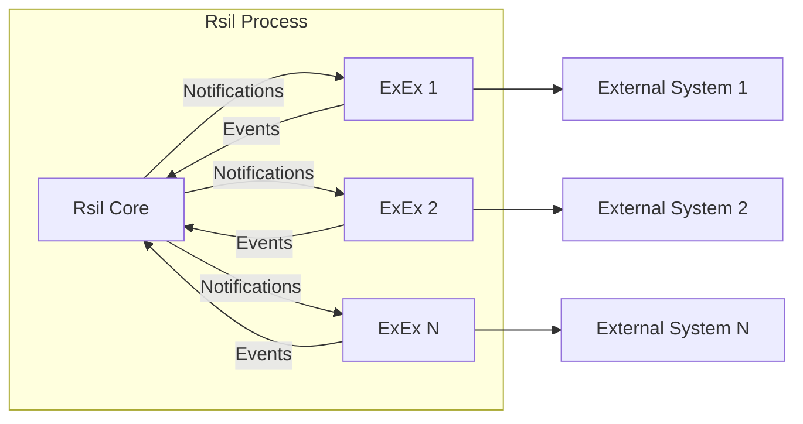

# Execution Extensions (ExEx)

## What are Execution Extensions?

Execution Extensions (or ExExes, for short) allow developers to build their own infrastructure that relies on Rsil
as a base for driving the chain forward.

An Execution Extension is a task that derives its state from changes in Rsil's state.
Some examples of such state derivations are rollups, bridges, and indexers.

They are called Execution Extensions because the main trigger for them is the execution of new blocks (or reorgs of old blocks)
initiated by Rsil.

Read more about things you can build with Execution Extensions in the [Paradigm blog](https://www.paradigm.xyz/2024/05/rsil-exex).

## Architecture

## What Execution Extensions are not

Execution Extensions are not separate processes that connect to the main Rsil node process.
Instead, ExExes are compiled into the same binary as Rsil, and run alongside it, using shared memory for communication.

If you want to build an Execution Extension that sends data into a separate process, check out the [Remote](/exex/remote) chapter.

## How do I build an Execution Extension?

Let's dive into how to build our own ExEx from scratch, add tests for it,
and run it on the SilaHolesky testnet.

1. [How do ExExes work?](/exex/how-it-works)
1. [Hello World](/exex/hello-world)
1. [Tracking State](/exex/tracking-state)
1. [Remote](/exex/remote)

:::tip
For more practical examples and ready-to-use ExEx implementations, check out the [rsil-exex-examples](https://github.com/sila-chain/sila-rsil-exex-examples) repository which contains various ExEx examples including indexers, bridges, and other state derivation patterns.
:::
