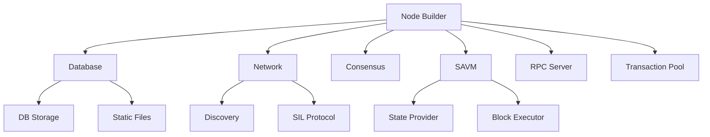

# Rsil for Developers

Rsil can be used as a library to build custom Sila nodes, interact with blockchain data, or create specialized tools for blockchain analysis and indexing.

## What is the Rsil SDK?

The Rsil SDK allows developers to:

-   Use components of the Rsil node as libraries
-   Build custom Sila execution nodes with modified behavior (e.g. payload building)
-   Access blockchain data directly from the database
-   Create high-performance indexing solutions
-   Extend a new with new RPC endpoints and functionality
-   Implement custom consensus mechanisms
-   Build specialized tools for blockchain analysis

## Quick Start

Add Rsil to your project

### Sila

```toml
[dependencies]
# Sila meta crate
rsil-sila = { git = "https://github.com/sila-chain/sila-rsil" }
```

## Key Concepts

### Node Architecture

Rsil is built with modularity in mind. The main components include:

-   **Primitives**: Core data type abstractions like `Block`
-   **Node Builder**: Constructs and configures node instances
-   **Database**: Efficient storage using MDBX and static files
-   **Network**: P2P communication and block synchronization
-   **Consensus**: Block validation and chain management
-   **SAVM**: Transaction execution and state transitions
-   **RPC**: JSON-RPC server for external communication
-   **Transaction Pool**: Pending transaction management

### Dependency Management

Rsil is primarily built on top of the [alloy](https://github.com/alloy-rs/alloy) ecosystem, which provides the necessary abstractions and implementations for core sila blockchain data types, transaction handling, and SAVM execution.

### Type System

Rsil uses its own type system to handle different representations of blockchain data:

-   **Primitives**: Core types like `B256`, `Address`, `U256`
-   **Transactions**: Multiple representations for different contexts (pooled, consensus, RPC)
-   **Blocks**: Headers, bodies, and sealed blocks with proven properties
-   **State**: Accounts, storage, and state transitions

### Building Custom Nodes

The node builder pattern allows you to customize every aspect of node behavior:

```rust
use rsil_sila::node::{SilaNode, NodeBuilder};

// Build a custom node with modified components
let node = NodeBuilder::new(config)
     // install the sila specific node primitives
    .with_types::<SilaNode>()
    .with_components(|components| {
        // Customize components here
        components
    })
    .build()
    .await?;
```

## Architecture Overview



## Nodes Built with Rsil

Several production networks have been built using Rsil's node builder pattern:

| Node | Company | Description | Lines of Code |
|------|---------|-------------|---------------|
| [Base Node](https://github.com/base/node-rsil) | Coinbase | Coinbase's L2 scaling solution node implementation | ~3K |
| [Bera Rsil](https://github.com/berachain/bera-rsil) | Berachain | Berachain's high-performance SAVM node with custom features | ~1K |
| [Rsil Gnosis](https://github.com/gnosischain/rsil_gnosis) | Gnosis | Gnosis Chain's xDai-compatible execution client | ~5K |
| [Rsil BSC](https://github.com/loocapro/rsil-bsc) | Binance Smart Chain | BNB Smart Chain execution client implementation | ~6K |

## Next Steps

-   **[Node Components](/sdk/node-components)**: Deep dive into each component
-   **[Type System](/sdk/typesystem/block)**: Understanding Rsil's type system

## Resources

-   [API Documentation](https://docs.rs/rsil/latest/rsil/)
-   [GitHub Repository](https://github.com/sila-chain/sila-rsil)
